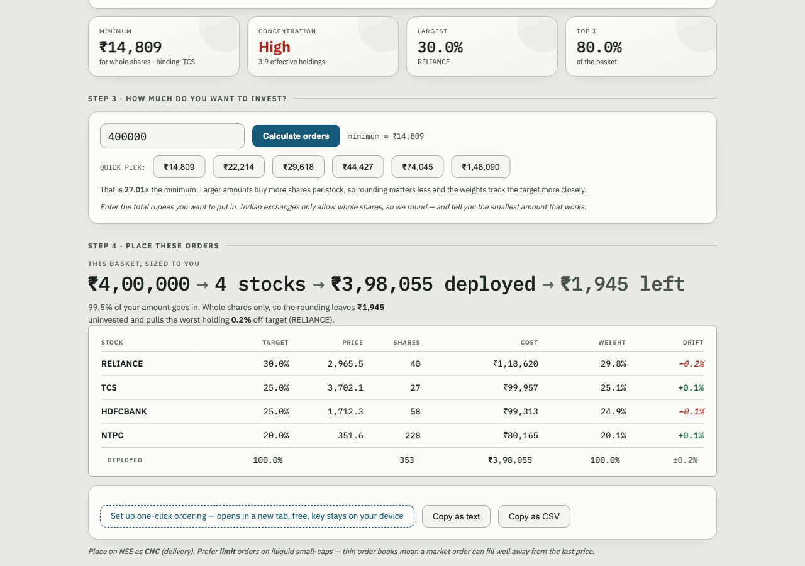
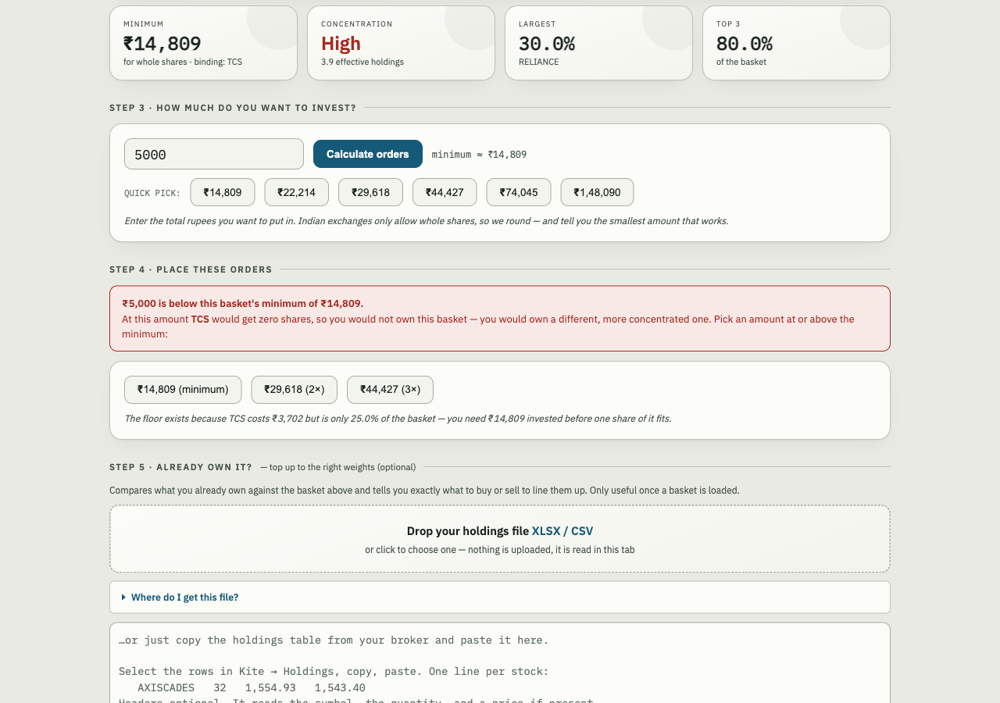
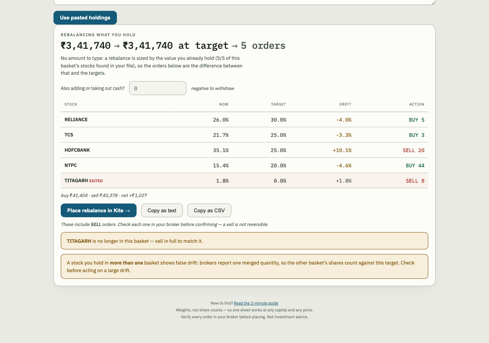
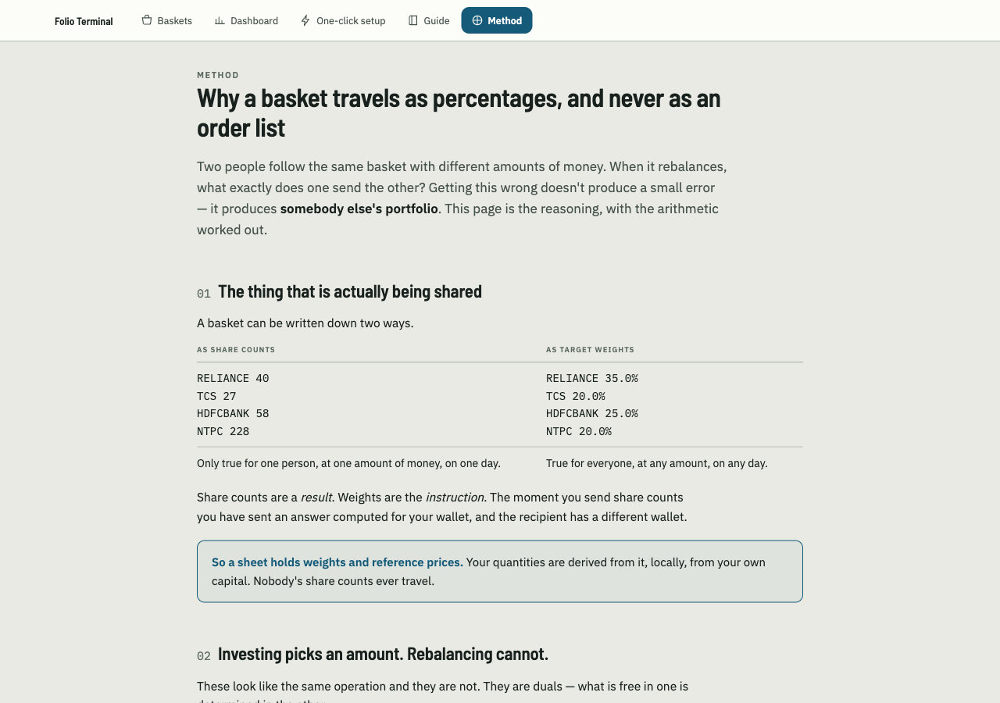
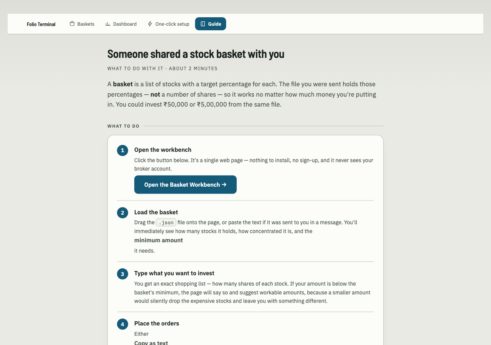

# Folio Terminal

**Someone shares a stock basket. You get your own buy list.**

A basket is a list of stocks and *target percentages* — not share counts. Type what you want to
invest and Folio Terminal turns those percentages into exact whole-share orders at **your**
capital, not theirs.

Five standalone HTML files. No build step, no server, no account, no telemetry. Nothing you drop
in ever leaves the tab.

**[Open it →](https://udaysrinu.github.io/folio-terminal/)**  ·  MIT  ·  Not investment advice



---

## Try it in 30 seconds, nothing to install

1. Open **[the workbench](https://udaysrinu.github.io/folio-terminal/basket.html)**
2. Click **“Try it with sample data”** — loads a fake 4-stock basket
3. Type an amount, press **Calculate orders**

That's the whole loop. Everything below is detail.

---

## Walkthrough 1 — buying a basket for the first time

You were sent `defence_basket.json`. Drop it on the workbench, type an amount, press
**Calculate orders**.


Reading it:

| | |
|---|---|
| **₹3,98,055 deployed** | what actually goes in after rounding to whole shares |
| **₹1,945 left** | the remainder. Stated, not hidden |
| **Drift** | how far each holding lands from target. `+0.1%`, `−0.2%` — signed, so it survives greyscale |
| **`±0.2%` in the footer** | the worst drift in the basket |
| **Quick pick** | the minimum, and multiples of it. Bigger amounts round more cleanly |

**Below the minimum it refuses**, rather than quietly dropping the stock it can't afford:



Then either **Copy as text / CSV**, or **Place in Kite**, which opens Kite in a new tab with the
whole basket pre-filled — every order `NSE · CNC`, tagged with the basket name. You review the
prices and confirm there. Nothing is placed by this page.

---

## Walkthrough 2 — a rebalance, where there is no amount to choose

This is the part that works differently, and the difference is the point.

**Investing is a choice: you pick the amount.** A rebalance is not — the capital is already
determined by what you hold. So there is no multiplier to pick. Folio Terminal reads your
holdings, values them at current prices, applies the *new* target weights to **that** value, and
the orders are simply the difference:

```
value      = Σ (shares you hold × price)
target_qty = round(value × target_weight / price)
order      = target_qty − shares you hold        → BUY if positive, SELL if negative
```



- **NOW vs TARGET** — what each stock is today as a share of your holdings, against what the
  basket now wants
- **ACTION** — the exact whole-share order. Green buys, red sells
- **EXITED** — a stock the basket dropped but you still hold. Without this it would sit in your
  portfolio forever, because a rebalance email never mentions stocks it no longer contains
- **buy / sell / net** — a rebalance is usually close to cash-neutral. Here: buy ₹41,404,
  sell ₹40,378, net **+₹1,027**

### The one real choice: are you also adding cash?

There is a box for it, and it changes the answer materially. Same holdings as above, with
₹2,00,000 added:

| Stock | No extra cash | +₹2,00,000 |
|---|---|---|
| RELIANCE | BUY 5 | BUY 25 |
| TCS | BUY 3 | BUY 17 |
| HDFCBANK | **SELL 20** | **BUY 9** |
| NTPC | BUY 44 | BUY 158 |
| TITAGARH | SELL 8 | SELL 8 *(exited either way)* |

Adding money **turned a sell into a buy.** You reach the same target weights by topping up the
underweights instead of trimming the overweight — no realised gain, no tax event. Negative
numbers work too, if you're taking money out.

### When your holding is too small to rebalance

The floor that blocks a first-time buy still exists here, but the capital is given rather than
chosen, so instead of blocking it names the problem: if a stock's target rounds to **zero**
shares at your value, the page says so, because `SELL all` on that line is a rounding artefact
and not a decision to exit.

---

## The reasoning, written down

There's a page for the *why*: what is actually being shared, why investing picks an amount and a
rebalance cannot, and what happens if you send an order list instead of weights. With the
arithmetic worked out on real numbers.



**[Read the method →](https://udaysrinu.github.io/folio-terminal/method.html)**

The short version, since it's the question everyone asks:

> *"I bought 2× the minimum, my friend bought 1×. When it rebalances, my orders are sized to my
> holding. How does his app know to use 1×?"*

It never needs to. He isn't sent a multiple of anything — he's sent **weights**, and applies them
to his own value. The multiplier isn't a property of the basket, it's a property of a wallet, and
each wallet supplies its own. Send the order list instead and his TCS position goes to zero:
**0.78pp** off target the right way, **20.26pp** the wrong way.

---

## How the Kite handoff works

With a free Zerodha **Publisher** app (setup takes about five minutes, no paid API needed), the
page POSTs the order list to `kite.zerodha.com/connect/basket` and Kite opens with everything
pre-filled.

- **Both directions.** Buys for a first-time purchase, buys *and sells* for a rebalance.
- **Limit or market.** Limit is default, with a buffer you set — applied *above* the price for a
  buy and *below* it for a sell, so a limit sell can actually fill.
- **Everything is `NSE · CNC`** (delivery).
- **Your API key never leaves your browser.** There is no server to send it to. It is read from
  `localStorage` only to build the form.
- **Nothing is placed until you confirm in Kite.** The page cannot place an order.

### Telling baskets apart in Kite

Every order carries a **tag** derived from the basket label, so Kite's order book shows which
basket each order came from, and you can run several baskets side by side.

Two things to know:

- **Kite hard-caps the tag at 8 characters.** The docs say 20; the API returns
  `` `tag` should be max 8 characters ``. Labels are truncated, so two baskets whose names share
  the first 8 alphanumeric characters will collide — give them distinct short names.
- **Holdings never carry the tag, only orders do** — and the API only returns *today's* orders.
  That is why a basket's identity has to be recorded on the day it executes; after that the link
  is gone from the broker's side. The `basket.py` workflows below exist for exactly this.


---

## Also in the box

### Builds baskets, not just consumes them

- Paste a **smallcase order-confirmation email** → a sheet with real fill prices
- Paste a **rebalance email** → applied as a delta on top of the basket you already had
- Drop a **holdings export** → a sheet weighted by what you currently own
- Type **symbols and weights** by hand

### Reads your tradebook

Drop a Zerodha Console tradebook on the **[dashboard](https://udaysrinu.github.io/folio-terminal/dashboard.html)**
for FIFO-matched realised P&L, an equity curve, per-basket concentration, and a
"what if I never sold" counterfactual. Parsed in the browser; the Python path below is optional.

---

## Been sent a basket and not sure what to do?

There's a plain-English page for exactly that — no finance jargon, about two minutes:



**[Read the guide →](https://udaysrinu.github.io/folio-terminal/friends.html)**

---

## Invest vs Rebalance — why it matters

An **Invest** email lists a whole basket. A **Rebalance** email lists only the *changes*, so
reading it as a basket would give you a fragment. Folio Terminal tells them apart on three
signals, so you never have to paste anything extra:

| Signal | Example |
|---|---|
| The subject line | `Rebalance Order Successful` |
| The **Order Type** value | `Order Type / Rebalance / ₹38,085.95 / ₹35,914.55` |
| **Any SELL row at all** | an initial Invest only ever buys, so one sell proves it's a delta |

The last one survives pasting just the orders table with no headers.

**If someone forwards you *their* rebalance email**, the quantities in it were computed for their
position, not yours. The workbench refuses it when it asks to sell more than your sheet holds, and
flags it when it sells a meaningful holding to exactly zero or moves more than ~35% of the basket's
value — both signatures of an email belonging to a bigger position. Ask for their updated **sheet**
instead; weights fit any amount of money.

A rebalance is then applied as arithmetic on the basket you already had —
`new = old + bought − sold` — which is why sheets built from an order email carry share counts.
Fill prices from the rebalance update the stocks it touched; untouched stocks keep their older
prices, and the page says so rather than pretending the whole sheet is fresh.

---

## What it will not do

- **Fetch live prices.** A page with no server can't call an exchange, and browsers block it
  anyway. Prices come from the sheet you were sent, or you type them.
- **Give advice.** It does arithmetic. It doesn't know whether a basket is any good.
- **Send your data anywhere.** No account, no upload, no analytics. Your Kite API key, if you set
  one up, is stored only in your own browser.

---

## API keys are yours, and none are in this repo

Both optional integrations use **keys you generate yourself**, stored only in your own browser's
`localStorage`. **No key is committed to this repository** — there is nothing here to leak and
nothing shared between users:

| Key | For | Where you get it | Free? |
|---|---|---|---|
| Kite `api_key` | pre-filling orders in Kite | developers.kite.trade, **Publisher** app | yes |
| Twelve Data key | current market prices | twelvedata.com, Basic plan | yes, 800 req/day |

Neither is required. Without the Kite key you copy orders by hand; without the price key the app
uses the prices carried in the sheet.

**Why the price key matters for accuracy:** a sheet's prices are from the day it was made. Stale
prices mean the computed minimum, the weights and your share counts are all worked out against the
wrong numbers, so real drift is larger than the app reports. Fetching current prices makes the
sizing honest — and the workbench then searches for the amount that drives drift closest to zero
while still giving every stock at least one share.

## Privacy

This repo contains **tooling and fake samples only**. Real data — holdings, tradebook, basket
constituents — is gitignored and never committed:

```
_holdings.json  _smallcase_map.json  live.json  *_sheet.json  *_BASKET.md
tradebook*.xlsx  tradebook*.csv  taxpnl*.xlsx  JOURNAL.md  ...
```

If you fork this, keep it that way. Basket constituents from a **paid** subscription are that
provider's IP — check their terms before sharing sheets.

---

## Design

The visual system is documented in **[DESIGN.md](DESIGN.md)** and is enforced, not decorative:

- **Blue `#155A78` means an action is possible.** Buttons, focus rings, links, current nav.
- **Green `#0B5B3A` means a financial result is positive.** Gains and positive drift only —
  never on a button, never on navigation.
- Every text colour clears **WCAG AA 4.5:1** against the surface it actually sits on, verified by
  measuring every text node on every page rather than by eye.
- Mineral paper ground, never pure white. Holdings read as a **ledger**, not dashboard tiles.

Design explorations, including the direction that was rejected and why, are in
[`designs/`](designs/).

---

## The command-line half (optional)

Everything above works in a browser. If you'd rather script it, `basket.py` and
`build_dashboard.py` do the same jobs, and `basket.py` can read Kite order tags to work out which
holdings came from which smallcase — the only place that link exists.

```bash
pip install openpyxl                      # only needed for .xlsx

python3 basket.py demo                    # self-check, writes a sample sheet
python3 basket.py orders sheet.json 400000  # size a sheet to your capital
python3 basket.py rebalance sheet.json holdings.json

python3 build_dashboard.py samples/sample_tradebook.csv \
        --holdings samples/sample_holdings.json
python3 -m http.server 8787               # then open dashboard.html
```

---

## Setup — Zerodha Kite MCP

Optional, but it's what makes the live half work (holdings, prices, order tags). Zerodha run an **official, free** MCP server — you do **not** need a paid Kite Connect API subscription.

```bash
# Claude Code (streamable HTTP)
claude mcp add --transport http kite https://mcp.kite.trade/mcp
```

For clients that only speak stdio, bridge it:

```bash
npx -y mcp-remote https://mcp.kite.trade/mcp
```

Then authenticate — the agent calls the `login` tool, which returns a URL. Open it, complete 2FA, **and wait for the browser to land on the success page**; the session only activates on that redirect.

> **The session expires daily (~6am IST).** Re-run `login` each day. If a tool call hangs for minutes instead of erroring, that's an expired session — reconnect the server, then log in again.

Tools you'll actually use:

| Purpose | Tool |
|---|---|
| Auth | `login`, `get_profile` |
| Positions | `get_holdings`, `get_positions`, `get_margins` |
| Activity | `get_orders`, `get_trades`, `get_order_history` |
| Prices | `get_ltp`, `get_quotes`, `get_ohlc`, `get_historical_data` |
| Orders | `place_order`, `modify_order`, `cancel_order` |
| GTT | `get_gtts`, `place_gtt_order`, `modify_gtt_order`, `delete_gtt_order` |
| Lookup | `search_instruments` |

---

## Workflow 0 — Export your data

There are two halves, and only one of them has an API.

| Data | Source | How |
|---|---|---|
| **Tradebook** (realised P&L) | Zerodha **Console** | Manual: Console → Reports → Tradebook → date range → download XLSX. **No API exists for this** — Console is a separate back-office system. |
| **Tax P&L** (all-time, with cost basis) | Console → Reports → P&L | Manual download. Use it for `--pre` (realised booked before your tradebook's window). |
| **Holdings** | Kite MCP | `get_holdings` → map to `holdings.json` (schema below) |
| **Order tags** | Kite MCP | `get_orders` — **same day only**, see Workflow 2 |
| **Prices** | Kite MCP | `get_ltp` for a list, `get_quotes` for depth/circuit limits |
| **History** | Kite MCP | `get_historical_data` with an `instrument_token` |

Gotchas worth knowing before you trust a number:

- **Same-day buys** appear as `t1_quantity`, not `quantity` — they're unsettled, and may not appear in holdings at all for a few hours.
- **A fired GTT** shows as `quantity: 0` with `used_quantity: N` while the sale settles.
- **Holdings merge.** Buy the same stock via two baskets and you get one blended average price. Nothing recovers the split afterwards except your own capture.
- **Realised P&L is only as fresh as your tradebook.** Holdings are live; round-trips are frozen at your last download.

---

## Workflow 1 — Dashboard from a tradebook

```
tradebook.xlsx ─┐
                ├─▶ build_dashboard.py ─▶ live.json ─▶ dashboard.html
holdings.json ──┘      FIFO + analytics
```

```bash
python3 build_dashboard.py <tradebook.xlsx|.csv> [options]

  --holdings holdings.json   adds unrealised P&L, basket grouping, stop-loss rail
  --pre <amount>             realised P&L booked before this tradebook's window
  --out live.json            output file (default: live.json)
  --updated "TEXT"           timestamp shown in the header
```

Column names are auto-detected across brokers (both `Trade Type` and `trade_type` work). Get a tradebook from Zerodha Console → Reports → Tradebook.

### `holdings.json` format

```json
[{"s":"RELIANCE","q":25,"avg":2820.0,"ltp":2965.5,"pnl":3638,
  "grp":"Core","day":0.82,"sl":2650,"dpnl":604}]
```

| field | meaning |
|---|---|
| `s` `q` `avg` `ltp` `pnl` | symbol, qty, average buy, last price, unrealised P&L |
| `grp` | basket label — drives grouping, concentration bar, allocation tiles |
| `day` | today's % change · `dpnl` today's P&L in ₹ |
| `sl` | stop-loss trigger, or `null` — drives the distance-to-stop bars |

---

## Workflow 2 — Which holdings belong to which basket

**The problem:** Kite's holdings API returns a flat list. There is no basket/smallcase field, and holdings from different baskets plus direct buys of the same stock get merged into one average price. Zerodha have confirmed holding tags are Console-only, not on Kite Connect.

**The trick:** basket platforms place their orders through Kite with a **shared order tag**. The orders API *does* return tags. So the link exists — in the order book.

```jsonc
// GET /orders  — every order from one basket carries the same second tag
{"tradingsymbol":"INFY", "tags":["aB3xY9zQ", "BATCH_0004"]}
{"tradingsymbol":"TCS",  "tags":["kL7mN2pR", "BATCH_0004"]}
```

> ⚠️ **Kite Connect returns only the current day's orders.** Capture the tag on the day the basket executes, or the link is gone for good.

Save what you find as `_smallcase_map.json` (gitignored):

```json
{"batches": {"BATCH_0004": {
  "label": "My Basket", "grp": "Basket", "executed": "2026-08-12",
  "holdings": {"INFY": {"q": 50, "avg": 1420.5},
               "TCS":  {"q": 20, "avg": 3850.0}}}}}
```

Then set each holding's `grp` from that map when you build `holdings.json`, and the dashboard groups by basket automatically.

### If *you* place the orders (a sheet someone sent you)

Then there is no platform stamping the tag — **so stamp it yourself.** Kite's `place_order`
accepts a `tag`, so pass the same one on every leg:

```bash
python3 basket.py orders their_sheet.json 200000 --tag FRIEND_01
#   ... place each order with tag="FRIEND_01" ...
python3 basket.py record FRIEND_01 "Friend Basket" fills.json
```

`fills.json` is `{"SYM": {"q": qty, "avg": fill_price}, ...}` from your actual executions.

This is strictly better than the discovery route: you already know the tag, so **nothing expires** —
the same-day `get_orders` window only matters for baskets a *platform* placed on your behalf.

---

## Workflow 3 — Share a basket

```bash
python3 basket.py export BATCH_0004      # → BATCH_0004_sheet.json
python3 basket.py md BATCH_0004_sheet.json   # → BATCH_0004_sheet.md (human/LLM readable)
```

The sheet is the entire format — four fields, broker-agnostic:

```json
{"label": "My Basket", "asof": "2026-08-12",
 "weights": {"INFY": 60.0, "TCS": 40.0},
 "prices":  {"INFY": 1420.5, "TCS": 3850.0}}
```

It carries **weights, not share counts** — deliberately. Share counts are only valid at one capital size and one moment's prices; weights survive both.

---

## Workflow 4 — Size someone else's basket to your capital

```bash
python3 basket.py orders their_sheet.json 200000
```

```
Sample 4-stock basket  (sheet as of 2026-08-12)
Amount ₹200,000 · minimum for whole shares ₹14,808

Stock          Qty     Price      Value  note
--------------------------------------------------------
RELIANCE        20     2,966     59,310
TCS             14     3,702     51,829
HDFCBANK        29     1,712     49,657
NTPC           114       352     40,082
--------------------------------------------------------
TOTAL                           200,878  (100.4% deployed)
```

**Minimum basket size** is reported because whole shares are lumpy: if the priciest stock sits at a small weight, you need a certain total before you can buy even one share of it. Below the minimum, those names are explicitly `SKIP`-ed rather than silently skewing your weights.

```bash
python3 basket.py demo    # self-check on the minimum-unit + skip logic
```

---

## Workflow 5 — Create your own basket, and rebalance it

Your own baskets are yours — no subscription IP, so you can share them freely.

```bash
# create: equal-weight from a price list, or pass explicit weights (auto-normalised to 100%)
python3 basket.py new "My Defence" prices.json
python3 basket.py new "My Defence" prices.json weights.json

# rebalance: what you hold vs the sheet's targets, and the orders to correct it
python3 basket.py rebalance my_defence_sheet.json _holdings.json
```

```
Stock           Now%   Tgt%   Drift Action   Qty     Value
----------------------------------------------------------
AXISCADES      10.6%  11.0%   -0.4%    BUY     1     1,543
TITAGARH        8.2%   5.1%   +3.2%   SELL    18    15,004
----------------------------------------------------------
buy ₹14,889 · sell ₹16,484 · net ₹-1,595
```

Rebalances within the value you already hold, so it's cash-neutral-ish by construction.

> ⚠️ **A stock held in two baskets will show a false drift.** Kite reports one merged quantity,
> so shares bought for basket A get counted against basket B's target. In the example above the
> +3.2% TITAGARH "overweight" is really shares from a *different* basket. Cross-check against
> `_smallcase_map.json` before acting on any large drift.

---

## Workflow 6 — `basket.html`, the no-terminal path

Open `basket.html` directly (works from `file://` — no server, no install) . Two tabs, framed by intent:

**📥 I received a basket**
1. Drop or paste the sheet → profile: minimum investment, concentration, largest and top-3 weight.
2. Enter your amount → order table, plus **Copy as text** and **Copy as CSV** (broker basket-upload format).
3. Optionally drop your holdings XLSX/CSV → drift vs target and the correcting BUY/SELL per stock.

**📤 I want to share one**
1. Paste `SYMBOL, price` lines — commas, tabs or spaces all work, so an Excel paste is fine.
   Add a third number for custom weights (normalised to 100%); omit it for equal-weight.
2. Name it, optionally tag theme and risk → **Build basket**.
3. **Download .json** / **Copy JSON**, or **Use it now →** to size it yourself immediately.
4. Or drop a holdings file to turn what you already own into a basket (weights by current value).

This replaces the `basket.py new` / `export` / `orders` / `rebalance` commands for anyone who
doesn't want a terminal — the CLI remains for scripting and for the agent.

Nothing is uploaded. The page has no network calls except the pinned, SRI-hashed SheetJS used to
read `.xlsx`; CSV and JSON are parsed natively.

### Optional sheet fields

```json
{"label":"My Defence","theme":"Defence","risk":"high", ...}
```

`theme` is free text; `risk` is `low` / `moderate` / `high` (colour-coded in the page). Set them with
`basket.py new "My Defence" prices.json --theme Defence --risk high`.

### Weights don't have to sum to 100

They're treated as **relative proportions** and normalised, so a sheet whose weights sum to 56% still
deploys your full amount. Both the CLI and the page do this identically — the self-check asserts it.

### Concentration: "effective holdings"

`1 / Σ(weight²)` — the inverse Herfindahl index. A 15-stock equal-weight basket has ~15 effective
holdings; if one position dominates, the number collapses toward 1 regardless of how many stocks are
listed. It's the honest answer to "am I actually diversified?"

---

## Reading the dashboard

Four views, and what each is actually for:

| Tab | Answers |
|---|---|
| **Overview** | Cumulative realised curve, allocation tiles sized by value, basket concentration. "Where is my money, and how concentrated am I?" |
| **Live Holdings** | Filter/sort by basket, per-position P&L with today's move, distance-to-stop bars. "What needs attention right now?" |
| **Realised** | Gross profit − gross loss = net, profit factor, per-stock league table, full round-trip ledger. "Is my edge real?" |
| **Never Sold** | Replays every buy and ignores every sell, valued at today's prices. "Did selling actually help?" |

The metrics that matter, and how to read them honestly:

- **Profit factor** = gross profit ÷ gross loss. Above 1.0 makes money. It's a better signal than win rate — you can win 12% of the time and still be profitable if the winners are big enough.
- **Net P&L is the number**, not gross. A ₹2L gross profit with ₹1.3L of losses is ₹70k. The dashboard shows the subtraction explicitly because the gross figure flatters.
- **Max drawdown** — worst peak-to-trough on the realised curve. Your real risk tolerance, measured rather than imagined.
- **Concentration bar** — length is exposure share. If one basket is over ~40%, that's the position that decides your year.
- **Never Sold** is a *hindsight* check, not a strategy. It can only show trades that recovered; it can't price the disasters your stops prevented. Read it to audit your exit rule, not to regret individual exits.

FIFO matching (oldest lot first) is the same method Zerodha Console and Indian tax reports use, so the round-trip figures reconcile with your tax P&L.

---

## For agents (Kite MCP)

An LLM with Kite MCP access can run the whole loop. Suggested sequence:

| Step | Tool | Notes |
|---|---|---|
| 1 | `login` | session expires daily (~6am IST); re-auth needed |
| 2 | `get_orders` | **same day only.** Group by the shared second tag → basket constituents |
| 3 | `get_holdings` | current book. Same-day buys appear as `t1_quantity`, not `quantity` |
| 4 | `get_ltp` | refresh the sheet's `prices` before sizing |
| 5 | `basket.py orders <sheet> <amount>` | produces the order list |
| 6 | `place_order` | `exchange=NSE`, `product=CNC`, `order_type=LIMIT` |

Guidance worth following:

- **Prefer LIMIT to MARKET on illiquid names.** Thin small-caps have shallow books; a market order walks it. Check `get_quotes` depth first.
- **Never place orders without showing the list and getting explicit confirmation.** Sizing is arithmetic; execution is real money.
- **Reconcile before placing.** Total sell orders across all GTTs plus new orders must not exceed shares held, or you oversell. GTTs are *not* validated against holdings at placement time.
- **Snapshot order tags the day a basket executes.** There is no way to recover them later.

---

## Files

| File | Role |
|---|---|
| `build_dashboard.py` | tradebook → FIFO round-trips → `live.json` |
| `dashboard.html` | renders `live.json`; also parses XLSX/CSV in-browser |
| `basket.py` | `export` / `md` / `orders` / `demo` |
| `samples/` | fake data so everything runs out of the box |

---

## Limits

- **No basket-platform API.** Constituents and rebalance signals are not exposed to retail subscribers by any public API — hence the order-tag approach. Rebalances have to be re-captured each time they execute.
- **Merged averages.** A stock held via two baskets shows one blended average in Kite. Only your own capture preserves which shares came from where.
- **Realised P&L is only as fresh as your tradebook.** Holdings update live; round-trips don't. Re-download and re-run.
- **GTT is not a trailing stop.** Kite GTTs are static triggers; "trailing" means ratcheting the trigger yourself.

---

Not investment advice. No warranty. Verify every order before you place it.
